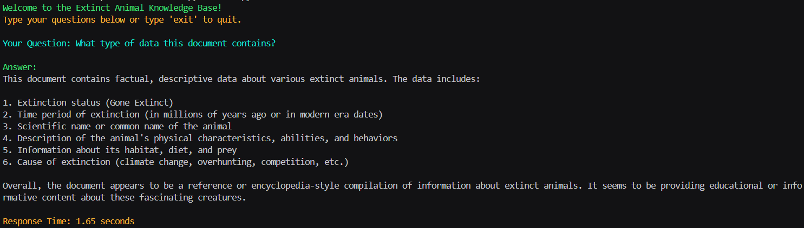

# 🚀 Cache Augmented Generation (CAG) - Supercharge Your LLM! 🧠⚡️

[](https://cacheaugmentedgeneration.streamlit.app/)

This project offers two implementations of Cache Augmented Generation (CAG), designed to drastically improve the performance of Large Language Models (LLMs) by pre-caching your knowledge base! Say goodbye to slow response times and hello to lightning-fast answers! ⚡️

## ✨ About

Cache Augmented Generation is a powerful technique that boosts the speed and efficiency of LLMs. By pre-computing and storing relevant information, CAG bypasses the need for real-time data retrieval, leading to significantly faster response times and a simplified system architecture.

## 📁 Files

*   `app.py`: Streamlit web application for interactive use. 🌐
*   `CAG.py`: Command-line interface for local testing. 💻
*   `Extinct Animals.pdf`: (Example PDF) Document with details on 20 extinct animals used for local testing with `CAG.py`. 🦖
*   `history.json`: JSON file to store questions and answers generated by `CAG.py`. 📜
*   `CLI-img.png`: Image showing the CLI interface (CAG.py). 🖼️

## 💻 `app.py`: Streamlit Web Application

`app.py` provides a user-friendly web interface to harness the power of CAG!

## ⚙️ Setup and Installation

Follow these steps to set up and run the CAG project:

1.  **Clone the repository:**

    ```
    git clone https://github.com/Shiv-D-Coder/Cache-Augmented-Generation-app
    cd Cache-Augmented-Generation-app
    ```

2.  **Create a virtual environment:**

    It's highly recommended to use a virtual environment to manage the project dependencies.

    ```
    python3 -m venv venv
    ```

3.  **Activate the virtual environment:**

    *   On Linux/macOS:

        ```
        source venv/bin/activate
        ```

    *   On Windows:

        ```
        venv\Scripts\activate
        ```

4.  **Install the dependencies:**

    ```
    pip install -r requirements.txt
    ```

5.  **Set up the Groq API key:**

    *   Create a `.env` file in the project root directory.
    *   Add your Groq API key to the `.env` file:

        ```
        GROQ_API_KEY=YOUR_GROQ_API_KEY
        ```

        Replace `YOUR_GROQ_API_KEY` with your actual Groq API key.

   6.  **Run command:**

    ```
    streamlit run app.py
    ```     


Features include:

*   **Upload Your Knowledge!** 📁: Supports `.pdf` and `.docx` files. Turn your documents into a super-fast knowledge base!
*   **Model Choice!** 🧠: Select from various available models (llama-3.1-8b-instant, gemma2-9b-it, qwen-qwq-32b).
*   **API Key Magic!** ✨: Provide your Groq API key for authentication.
*   **History in Your Hands!** 📜: Download your entire conversation history in a convenient JSON format.

**Important**: Keep in mind that CAG shines with documents that fit within the context window token size of your chosen model! For massive documents, try breaking them down or summarizing them first!

## ⌨️ `CAG.py`: Command-Line Interface

`CAG.py` allows you to experience the benefits of CAG right in your terminal!

Features:

*   **Colorful Fun!** 🌈: Uses `colorama` for a visually appealing and easy-to-read output.
*   **Local Knowledge!** 📚: Comes with the `Extinct Animals.pdf` file, pre-loaded with juicy details about 20 extinct animals!
*   **Ask Away!** 💬: An infinite loop lets you ask question after question until you type "exit."
*   **Keep Track of Your Thoughts!** 📝: All questions and answers are saved to a `history.json` file.
*   **Time is of the Essence!** ⏱️: See exactly how long each answer takes to generate!

### Example

```
python CAG.py
```




*Find saved qus and ans in history.json file.*

```
{
    "model": [
        {
            "question": "tell me about docs",
            "answer": "It seems like you meant to ask about the Dunkleosteus. However, since you asked about \"docs,\" I'll assume you're asking about something else. There's not much information in the text provided about what you might be referring to as \"docs.\"\n\nHowever, I found 2 possible options:\n\n1. **Donald Duck** (also known as \"DD\" or \"The Duck\"): Some people abbreviate \"Donald Duck\" as \"DD\" or \"The Duck,\" while others simply refer to him as \"doc\" due to his medical or scientific pursuits. \n\n2. **Doctor (Medical Professional)**: Docs is an informal term for a medical doctor or a physician. It is a common colloquialism used to refer to a person who has earned a Doctor of Medicine, Doctor of Osteopathic Medicine, or Doctor of Veterinary Medicine degree.\n\nIf you are referring to the Dunkleosteus, I can answer that here as well. However, if you had another animal in mind, I'd be happy to provide information on that animal instead."
        },
        {
            "question": "Tell me about Extinct Animals",
            "answer": "Here's the knowledge base on Extinct Animals that I've extracted from the text:\n\n**1. Tyrannosaurus Rex**\n- Gone Extinct: ~66 million years ago (Late Cretaceous)\n- Description: A massive carnivore with powerful jaws and banana-sized teeth, standing about 12 feet tall at the hips and reaching lengths of 40 feet.\n- Fossil evidence suggests excellent vision and a strong sense of smell.\n\n**2. Megalodon**\n- Gone Extinct: ~3.6 million years ago (Pliocene Epoch)\n- Description: A massive shark growing up to 60 feet long, three times longer than the largest great white shark.\n- Ruled the oceans for millions of years before going extinct due to climate change, declining food sources, and competition from smaller, more agile sharks.\n\n**3. Titanoboa**\n- Gone Extinct: ~58 million years ago (Paleocene Epoch)\n- Description: The largest snake ever discovered, reaching lengths of up to 42 feet and weighing over a ton.\n- Thrived in warm, swampy regions of prehistoric South America, hunting large fish and possibly crocodile-like reptiles.\n\n**4. Smilodon (Saber-Toothed Cat)**\n- Gone Extinct: ~10,000 years ago (End of the Ice Age)\n- Description: A powerful predator with long, curved canine teeth, hunting large Ice Age mammals like bison and mammoths.\n- Fossils found in tar pits suggest it lived in groups, possibly cooperating to bring down big prey.\n\n**5. Quagga**\n- Gone Extinct: 1883 (Modern Era)\n- Description: A subspecies of the plains zebra native to South Africa, with a unique coat pattern \u2013 stripped in the front, plain brown in the back.\n- Heavily hunted by European settlers for its hide and to reduce competition with livestock.\n\n**6. Woolly Mammoth**\n- Gone Extinct: ~4,000 years ago (Holocene Epoch)\n- Description: Massive, shaggy-coated elephants roaming icy tundras during the Ice Age, using their long, curved tusks to dig through snow for food.\n- Coexisted with early humans, who hunted them for meat, fur, and bones.\n\n**7. Andrewsarchus**\n- Gone Extinct: ~36 million years ago (Eocene Epoch)\n- Description: A giant, wolf-like mammal with a skull over 3 feet long, one of the largest carnivorous land mammals ever discovered.\n- Believed to be a relative of modern whales and hippos, likely scavenged and hunted small to medium-sized animals.\n\n**8. Dunkleosteus**\n- Gone Extinct: ~358 million years ago (Late Devonian Period)\n- Description: A massive armored fish, reaching up to 33 feet in length, instead of teeth, it had sharp, bony plates forming a powerful bite capable of slicing through prey with ease.\n- One of the top predators of ancient seas, feeding on fish, sharks, and even its own kind.\n\n**9. Thylacine (Tasmanian Tiger)**\n- Gone Extinct: 1936 (Modern Era)\n- Description: A carnivorous marsupial native to Australia and Tasmania, resembling a mix between a wolf and a tiger.\n- Hunted to extinction due to conflicts with farmers who blamed it for livestock losses.\n- Despite occasional unverified sightings, it is officially considered extinct.\n\nLet me know if you'd like me to clarify any information about these extinct animals!"
        },
        {
            "question": "What type of data this document contains?",
            "answer": "This document contains factual, descriptive data about various extinct animals. The data includes:\n\n1. Extinction status (Gone Extinct)\n2. Time period of extinction (in millions of years ago or in modern era dates)\n3. Scientific name or common name of the animal\n4. Description of the animal's physical characteristics, abilities, and behaviors\n5. Information about its habitat, diet, and prey\n6. Cause of extinction (climate change, overhunting, competition, etc.)\n\nOverall, the document appears to be a reference or encyclopedia-style compilation of information about extinct animals. It seems to be providing educational or informative content about these fascinating creatures."
        },
        {
            "question": "",
            "answer": "It seems you want me to provide answers to questions about the extinct animals listed in the knowledge base. However, I don't see any questions provided.\n\nPlease go ahead and ask your questions, and I'll do my best to provide detailed answers based on the information in the knowledge base."
        },
        {
            "question": "",
            "answer": "It seems like you're asking me to list items from your extensive extinct animals knowledge base.\n\nHere's item 1 from the list:\n\n1.  Tyrannosaurus Rex\nGone: Extinct till: ~66 million years ago (Late Cretaceous)\nDescription: One of the most famous dinosaurs, T. rex was a massive carnivore with powerful jaws and banana-sized teeth capable of crushing bones. It stood about 12 feet tall at the hips and could reach lengths of 40 feet. Fossil evidence suggests it had excellent vision and a strong sense of smell, making it a top predator. Despite its short arms, it had a strong bite force, among the strongest of any land animal. T. rex likely scavenged in addition to hunting."
        }
    ]
}
```

Feel free to change, tweak, and play around with the code to explore the endless possibilities of CAG! 🧪 🧰